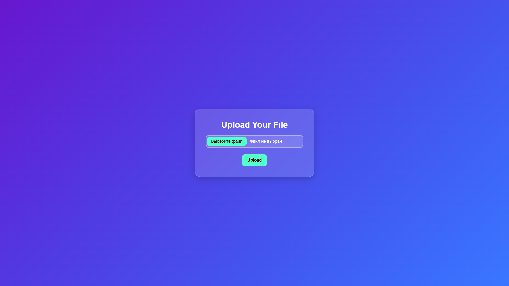

# 🧠 Object Recognition AI


This is an **educational project** focused on building a **neural network** capable of recognizing objects and data from images 🖼️, as well as creating an interactive **web interface** for it using **Flask** 🌐.

In the future, I want to add:  
- 🧩 Displaying all previously processed images (with results) directly in the interface  
- 🗂️ Adding user data tracking and session management  
- 🧠 Training a more accurate and efficient model  

---

## 🚀 Technologies Used

- 🧠 **TensorFlow / Keras** - for model creation and training  
- 🌐 **Flask** - for the web interface and backend  
- 📊 **NumPy** and **Pandas** - for data handling and preprocessing  

---

## ⚙️ Setup Guide

### 1️⃣ Create or use the model

- A pre-trained [test model](model/model.h5) is already included — it recognizes **sports types** from images (100 categories) with around **60% accuracy**.  
- You can also train your own model using this **[Google Colab example](https://colab.research.google.com/drive/1Syzw0Mfod-SDlRCeGCqYgyP6FNHgFIfZ?usp=sharing)**.  
- After training, save your model in the [`/model`](model/.) directory and update [`classes.json`](model/classes.json) accordingly.  

### 2️⃣ Install dependencies

```bash
python -m venv .venv
.venv\Scripts\activate   # Windows
source .venv/bin/activate   # Linux / macOS
pip install -r requirements.txt
```

### 3️⃣ Run the project

```bash
python main.py
```

---

## 💾 Data Saving and Feedback

After image recognition, you can mark the result as **Correct ✅** or **Incorrect ❌**.  
Your choice determines where the image will be stored:  

```
data/
├── correct/     # Confirmed correct predictions
└── incorrect/   # Incorrect predictions for future model improvement
```

This allows collecting feedback for retraining and improving accuracy over time.

---

## 🗂️ Project Structure

```
Object-Recognition/
│
├── data/
│   ├── correct/
│   └── incorrect/
│
├── model/
│   ├── classes.json
│   └── model.h5
│
├── static/
│   ├── css/
│   ├── img/
│   └── uploads/
│
├── templates/
│   ├── base.html
│   ├── result.html
│   └── upload.html
│
├── main.py
├── prediction.py
├── settings.py
├── requirements.txt
└── README.md
```

---

## 👤 Author

Created by **Danylo Skepskyi**  
GitHub: https://github.com/SkepskyiDanylo  
Email: skepskyidanylo@gmail.com

---

## 📜 License

This project is licensed under the **MIT License** — feel free to use, modify, and share it for educational purposes.

---

## 📸 Examples

